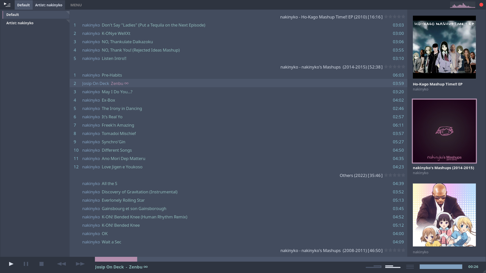
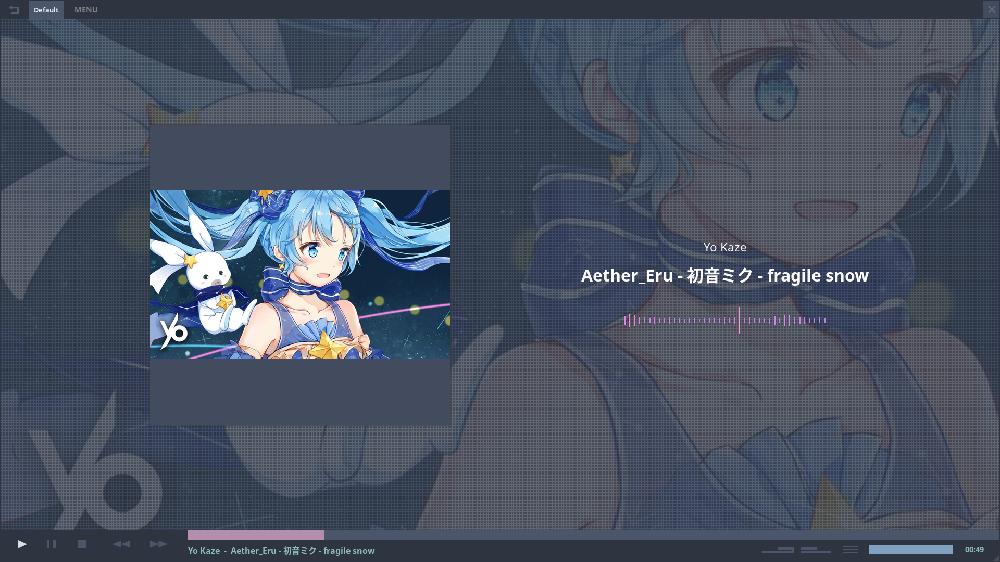

## Nord theme for Tauon Music Box

This is a custom nord theme for [tauon](https://github.com/Taiko2k/TauonMusicBox), based on the ash theme.
Still needs a bit of work, if anybody is actually using this feel free to create an issue.

nordic-ash.ttheme = no wasted white space

nordic-comments.ttheme = added some comments for easier editing 

### Installation

Install any custom theme by placing the `.ttheme` in Tauon's theme folder

`~/.var/app/com.github.taiko2k.tauonmb/data/TauonMusicBox` (for flatpak)

`~/.local/share/TauonMusicBox/theme/` (for aur)

or

Open `Menu > Settings > Function > Open data folder`.

Place `nordic-ash.ttheme` inside `theme` folder.

### Links

Community theme thread:
https://github.com/Taiko2k/TauonMusicBox/discussions/461

Wiki page on theming:
https://github.com/Taiko2k/TauonMusicBox/wiki/Theming

## Screenshots

